# Full Guide to Limesurvey

## Part 1 - Creating a Survey

The first part of this tutorial begins in LimeSurvey. Here, we're going to begin setting up our survey to collect our data.

Begin by logging into your LimeSurvey account. You will see one or more actions to take. For now we're going to click on the "List Surveys" option

[Image of LimeSurvey Survey List page](/assets/Untitled.png)

This is the LimeSurvey homepage. Here you can create surveys, or monitor the ones you've created.

Here we can view the surveys we have created along with their basic information such as whether or not a survey is actively taking responses or how many responses we've received thus far.


There will be a button in the top left corner of the homepage that reads "Create a new Survey." Press this to begin the survey creating process.

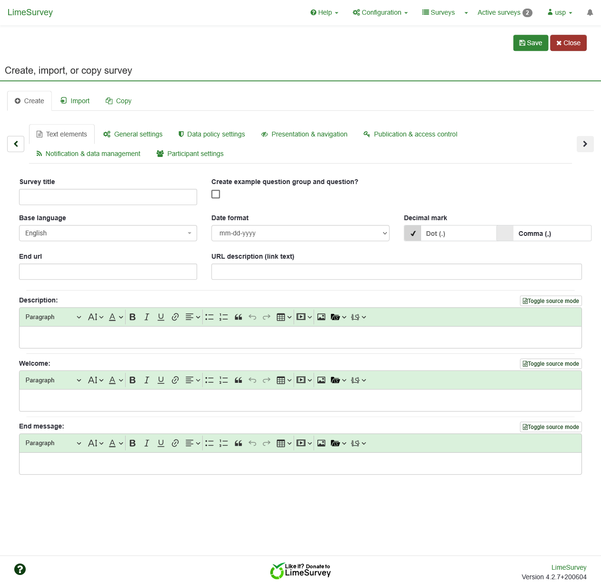

Here we have many options to customize the functionality of our survey. You can read more about the specifics of each option [here, as part of LimeSurvey's documentation.](https://manual.limesurvey.org/Surveys_-_introduction)

To begin, enter the title of your survey. Here you can also enter a description for the survey and a welcome message, which the users will be able to read before they begin their survey response. We will revisit the "End message" soon, but first we need to save the survey in order to initialize it.

Press the "Save" button in the upper right hand corner.

### Write Down Your Survey ID


After saving, you should be redirected to your survey homepage. Here, you can revise the settings of the survey and make changes to it's functionality.

You should see a number in parenthesis next to the title of your survey. Write this number down as we will need to use it in the following step.

- For example, in the above picture we see that our Survey ID is 772653

### Create an End Message

Next, we're going add an end message and include an important piece of code that allows our survey to function correctly.

Select the menu item titled "Text elements" in the sidebar of your survey homepage.


You will now see a page that looks very similar to the starting page of our survey creation.

Click on the toggle that reads "Toggle Source Code" to the right of the End Message block.


Your End Message block should now look like this:


Copy this block of code and paste it into the "End Message" block

```jsx
<script type="text/javascript" charset="utf-8">
              $(document).ready(function(){
                  var val = {SID}
                             $.ajax({
            url: 'https://limesurvey-flask.sdsc.edu',
            type: 'GET',
            dataType:'json',
            data: {
              survey_id: {SID},
              token: "{TOKEN}"
            },
            success: function(data){
                console.log(data);

            },
                             });
              });
</script>
```
Now it should look like this:

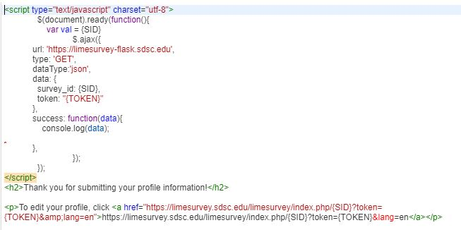

You can then add whatever ending message you want by adding more html code, or replacing the text that says "Thank you for participating in this survey!" For example, you can enter

```jsx
<p>Thank for your submitting your information!<br>&nbsp;</p><p>To edit your responses to this survey, click <a href="https://limesurvey.sdsc.edu/limesurvey/index.php/123456?token={TOKEN}&amp;lang=en">https://limesurvey.sdsc.edu/limesurvey/index.php/123456?token={TOKEN}&amp;lang=en</a></p><p>Your access code for this survey is: {TOKEN}.</p><h3>To view survey responses in SuAVE <a href="https://suave2.sdsc.edu/main/file=surveyauthor_surveyname.csv&amp;view=grid">Click here</a></h3>
```

**Important:** Make sure you press the green save button in the top right before moving on to the next step.

After Saving, you can click the "Toggle Source Code" button again in order to preview what the ending message will look like. This is what the above source code looks like to the survey participant:


- **Note:** If you want to change the end message in the future, you may have to repeat this step and paste in the code again

## Part 2 - Adding Questions

- Next, navigate to the "Group list" tab on the left navigation bar

  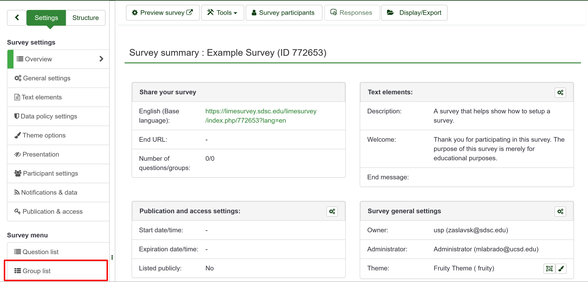

- We're going to begin by creating a question group, which is essentially a set of questions that will be grouped together on a single page in your survey.

Note that there must be at least one question group, since each question has to belong to a question group, but it is not required to have more than one question group.

- This is what the question group page looks like:


- Your question group does not require any of the fields to be filled in, however we recommend you at least add a title, which will help identify the question group and will show up on the top of page when the survey questions are presented.
- You can read more about question groups in the official [LimeSurvey Documentation here.](https://manual.limesurvey.org/Question_groups_-_introduction)
- When done configuring your question group, make sure you press the green "Save" button in the top right.
- Next, add a question by clicking "Add Question" in the left navigation bar, or by clicking "Save and add question" in the top right
  - To view questions and question groups in the left navigation bar, you will have to select the "Structure" option at the top of the navigation bar.

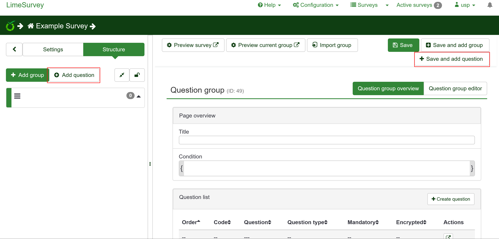

- Next, we will setup the survey questions in order to collect the data that we'll present in SuAVE.

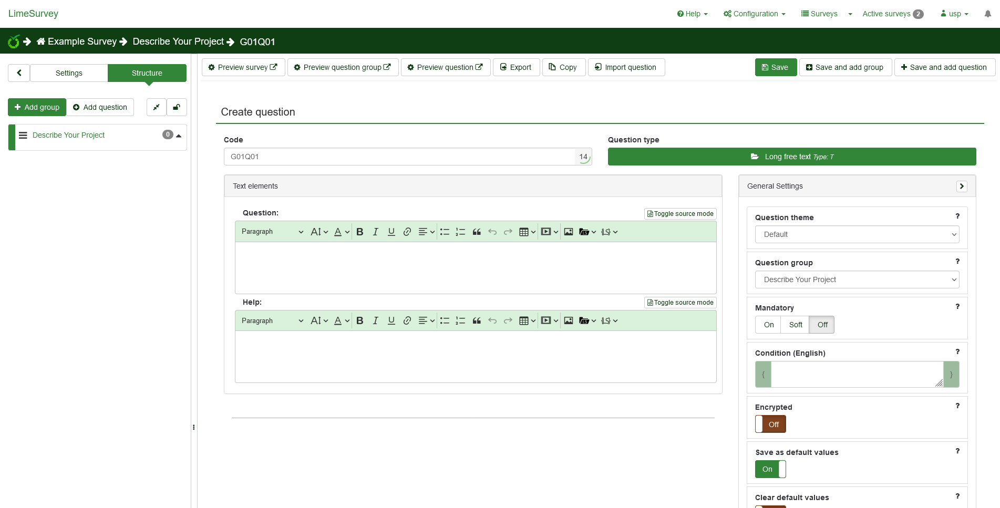

Survey questions are very versatile and are able to handle many data formats, including but not limited to: multiple choice selections, images, and free form text.
### For a list of example questions, click [here](https://suave-ucsd.github.io/SuAVE-Documentation/Example_Mappings.html)

- You can read more about setting up questions in the official [LimeSurvey Documentation here](https://manual.limesurvey.org/Questions_-_introduction).
- Once you have configured your question, ensure you save it by pressing the green "Save" button in the top right.

### Collecting Question Codes

- Each question has a question code that is either user defined or automatically assigned, which we will need in order to funnel the data into SuAVE. In this step, we're going to collect those question codes.

- In the left navigation bar select the "Settings" toggle in the top left and click "Question list."

  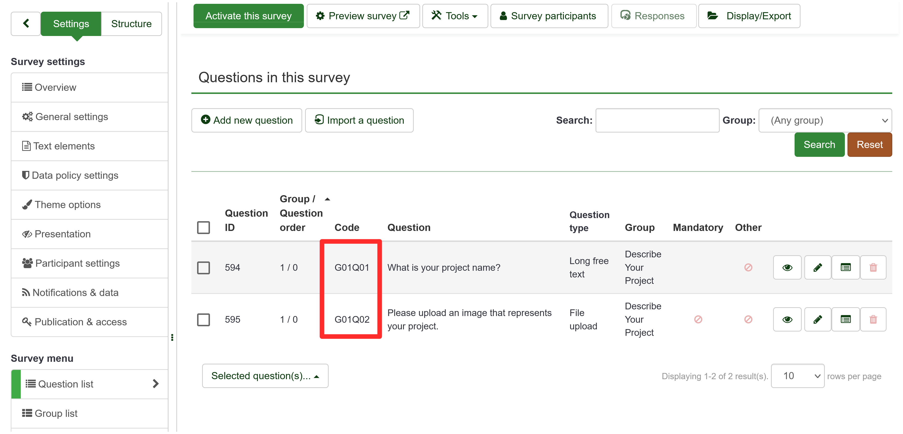

  - Write down a list of the question codes of the questions that contain information that you would like to display in SuAVE. We will need these for the following step.

### Activate Survey

- When you are done configuring your survey, you will need to activate it in order for it to be open to responses.

- In the toolbar at the top of the page there will be a green button titled "Activate Survey" which will take you through the activation steps.

  

You can use the "Preview survey" button to get a preview of what the survey respondents will see before activating your survey.

## Checkpoint

- By now you should have the **survey id** and a list of the **question codes** that pertain to the responses you would like to display in SuAVE
- Checklist
  - [ ] Survey ID
  - [ ] Question Codes


## Part 3 - Encode Questions in Google Sheets

### What you'll need:

- [ ] A Google account
- [ ] The Survey ID from the previous section
- [ ] The Question Codes from the previous section

### Create a new Google Spreadsheet

- Begin by visiting Google Sheets at [sheets.google.com](http://sheets.google.com)
- Create a spreadsheet

### Configure Spreadsheet Sharing Permissions

- Click the "Share" button in the top right of the Google Sheets Page

  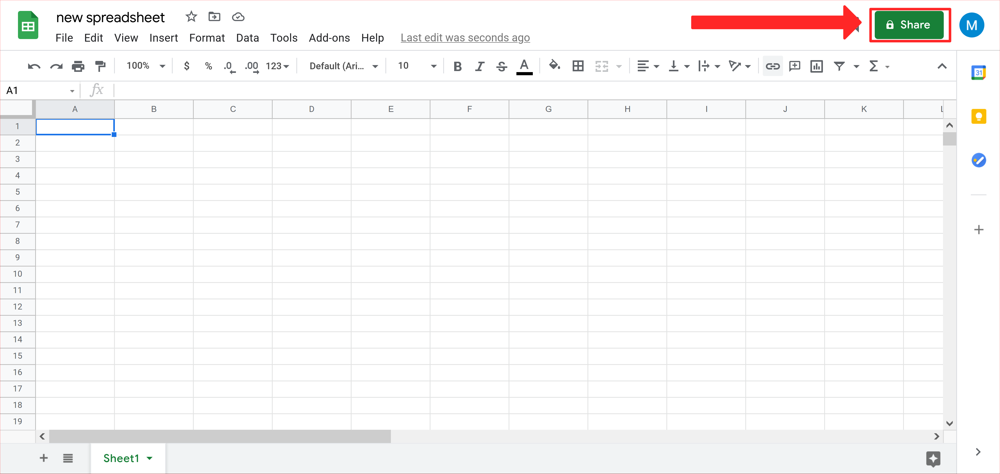

- You will be presented with the following menu:

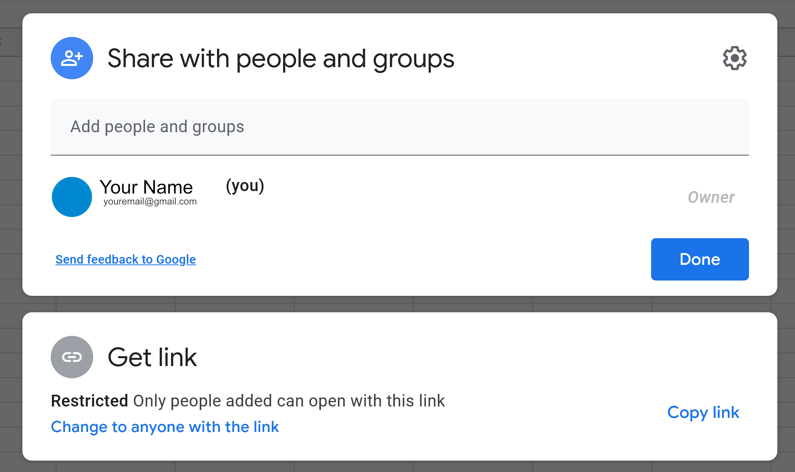

- In the box that says "Add people and groups" you will enter the following email:

```
limesurvey-flask@fusion-r2r.iam.gserviceaccount.com
```

- You will be prompted with this menu. Ensure that the share permission is set to "Editor."
- Press Send.

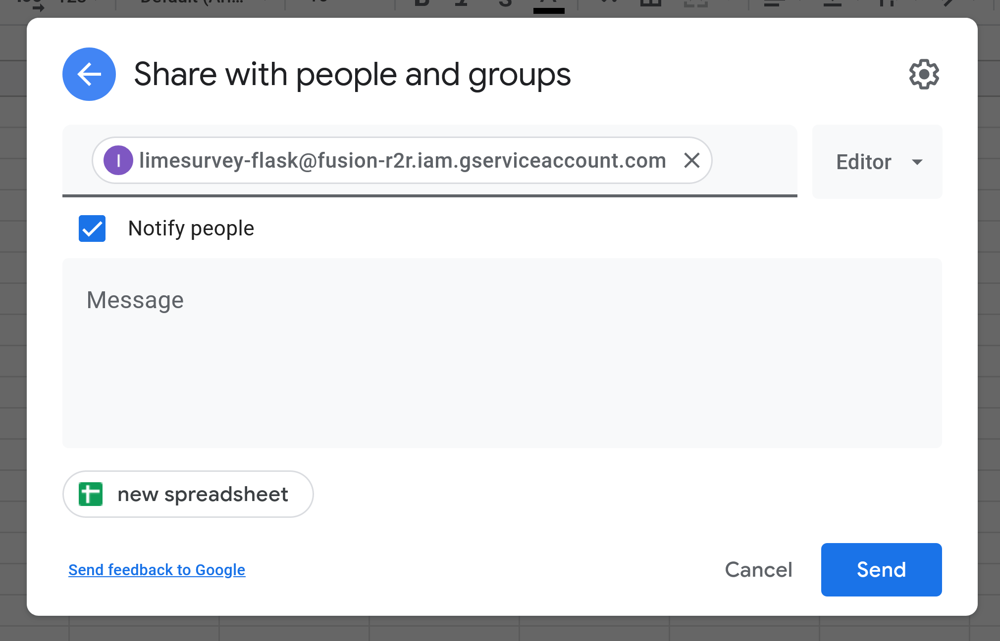

- Next go back to the share menu and under the "Get Link" menu, click "Change to anyone with the link"
  - This will ensure that SuAVE has permissions to read the spreadsheet for the collected data.

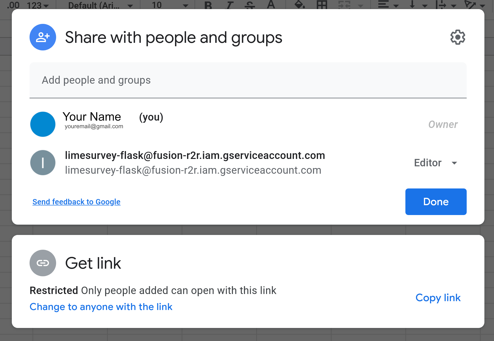

- Your share menu should now look like this. Ensure that the permission for "Anyone with the link" is set to "Viewer"

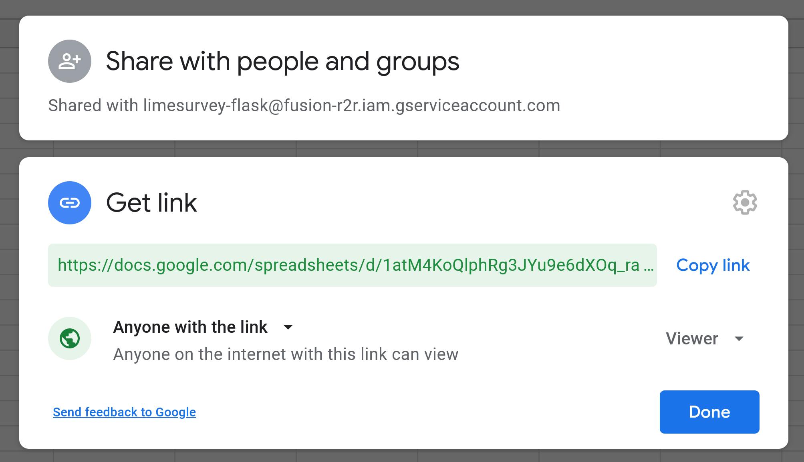

- Next, click "Copy link" and save it somewhere. **We will need it in a later step.**

## Configuring the Spreadsheet

- Rename the spreadsheet to the ID of your survey
- Create a new spreadsheet tab by clicking the "+" button on the bottom left of the screen.

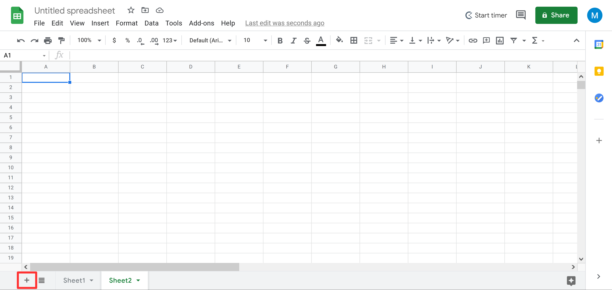

- Renaming the spreadsheet tabs

  - To rename a spreadsheet tab, right click on it or click on the triangle and select "Rename" from the menu.

  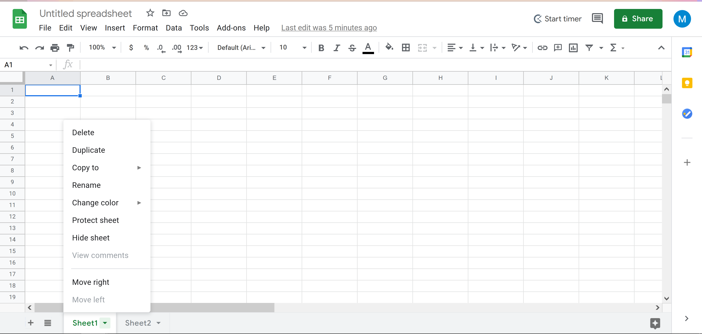

  - Rename the first spreadsheet tab to the survey ID collected in the previous section. Make sure to rename the title of the spreadsheet to be the survey ID as well.

  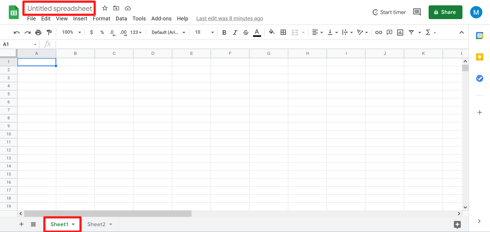

  - Rename the second tab to "mappings"

## Filling in the "mappings" tab:

- On the first row of your spreadsheet, add in the following values:

  - SuaveFieldName
  - ExpressionType
  - BasedOn
  - Mapper

- Next, we're going to fill in these columns with the relevant information

  ### **SuaveFieldName**

  - This is how the data will be labelled in SuAVE.

  - You can add "qualifiers" which change the way the response data is interpreted in SuAVE. These are not required, but are helpful.

    - Example: **Using the #sortquan qualifier to sort labels from responses by the amount of responses with that label.**

      - If you have a question in the survey with the question **"What region is your entry from?"** then you can add #sortquan at the end of the title you enter into the SuAVEFieldName column.

      ```
      SuAVEFieldName: Region#sortquan
      ```

      - In SuAVE, the search menu will sort the labels of the "Region" question responses by quantity.

      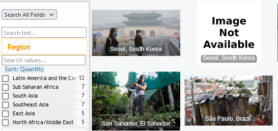

  ### **ExpressionType**

  - The ExpressionType column helps format the response that is collected in limesurvey into the final entry that is presented in SuAVE.

    - A list of possible expression types are:

      - copy, dict, multi_from_dict, multi_from_typed, geoLa, geoLo, template

    - copy:

      - Makes a direct copy from the question response to what is displayed in the feature in SuAVE.

      - This is useful for questions with text boxes in LimeSurvey

      - No Mapper is needed

      - **Example: Simple Copy**

        - If we simply want to copy the exact response from our survey question (with question code "favorite_sport") over to SuAVE, we would use the "copy" expression type with a configuration that looks like this:

          

    - multi_from_dict:

      - Very similar to dict, allows a survey response entry to be labelled and filtered by more than one label.

      - **Example: Question of type "Multiple choice (M)" in LimeSurvey**

        - Under SuAVEFieldName, you will want to add the "#multi" qualifier after your desired feature title.
        - If you go to your question in LimeSurvey and scroll down you will see a tab titled "Subquestions." Clicking that will display the subquestion codes that you can make a dictionary of.

        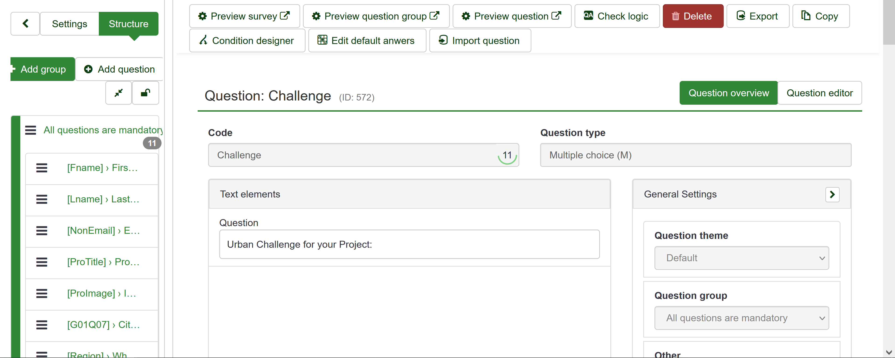

        - Scroll down when you get to your question in LimeSurvey

        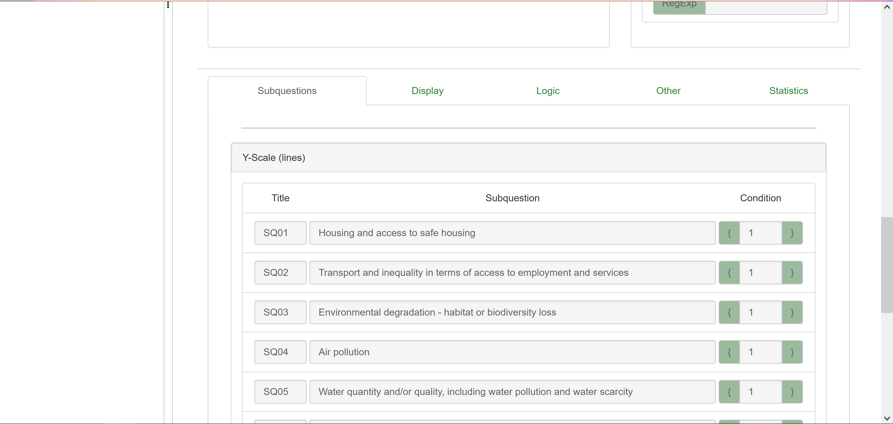

        - Create a list of the subquestions that you would like to display in SuAVE like below.
          - Each item should be in the format of "QuestionCode[SubquestionTitle]"

        ```
        Challenge[SQ01],Challenge[SQ02],Challenge[SQ03],Challenge[SQ04],Challenge[SQ05],Challenge[SQ06],Challenge[SQ07],Challenge[SQ08],Challenge[SQ09],Challenge[SQ10],Challenge[SQ11],Challenge[SQ12],Challenge[other]
        ```

        - We will enter this list into the BasedOn column of our "mappings" spreadsheet

        - Next, under our "Mapper" column we will format each subquestion in the format of:

          ```
          {'QuestionCode[SubquestionTitle1]':'Name to be displayed for option 1','QuestionCode[SubquestionTitle2]':'Name to be displayed for option 2'}
          ```

        - In our case, we end up with this entry:

          ```
          {'Challenge[SQ01]':'Housing and access to safe housing','Challenge[SQ02]':'Transport and inequality in terms of access to employment and services','Challenge[SQ03]':'Environmental degradation - habitat or biodiversity loss','Challenge[SQ04]':'Air pollution','Challenge[SQ05]':'Water quantity and/or quality, including water pollution and water scarcity','Challenge[SQ06]':'The arrival of refugees and migrants from other areas','Challenge[SQ07]':'Livelihoods - access to stable employment','Challenge[SQ08]':'Food systems - access to and/or ability to produce food in and around the city','Challenge[SQ09]':'Massive land acquisition by private actors','Challenge[SQ10]':'Energy and alternative energy sources (decarbonization)','Challenge[SQ11]':'Climate change adaptation (to extreme events and stressors)','Challenge[SQ12]':'Urban-rural linkages','Challenge[other]':'Other'}
          ```

        - This is how our question is represented in SuAVE, allowing us to sort the responses by the tags that were derived from our subquestions.

          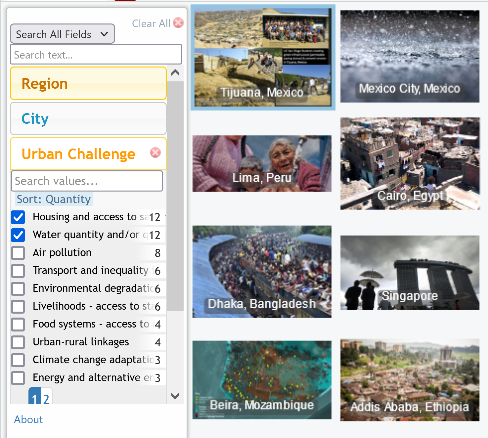

    - dict:

      - Good for questions that come with sub-questions.
      - If a response can be filtered/identified by a specific label that is designated in a question, then a dict is a good option
      - The setup is the same as multi_from_dict, without the #multi qualifier

    - multi_from_typed:

      - Used when you want participants to type in multiple responses and use each response as an option on SuaVe.
      - You should add "#multi" qualifier after the SuaveFieldName
      - ExpressionType is multi_from_typed
      - Say if your limesurvey question ID is keywordm then the BasedOn should look like this.
      ```
      keywords[S1],keywords[S2],keywords[S3],keywords[S4],keywords[S5]
      ```


    - geoLa/geoLo

      - If a question uses the "Short Free Text" question type that asks respondents to select a location on a map, then these ExpressionTypes will be required to display responses on a map in SuAVE
      - With a question that has the QuestionCode of "Latlon" we will add two rows into our "mappings" spreadsheet and enter the configuration as follows:

      

      

    - template

      - The template ExpressionType allows us to format question responses in a way ttha

      - Example: **Combining two questions asking for last and first name into one feature in SuAVE.**

        - the template expression will allow us use the "Mapper" column to specify how our question responses show up in SuAVE.

        - In this case, there are two separate questions with the codes: Fname and Lname.

        - Here a student submits their first and last name in the separate respective questions and the mapper formats the responses to show their last name first followed by a comma and space and then their first name.

          

          

  ### **BasedOn**

  - In the previous step, we collected a list of question codes that we wanted to display in our SuAVE survey.
  - In this column, you can add one or more question codes to use in the row
  - The examples above exemplify how BasedOn should be filled given your question codes.

  ### **Mapper**

  - This field is used in tandem with certain ExpressionTypes to format question responses in a specific way.
    - The examples from above help exemplify how each ExpressionType expects the Mapper column to be formatted.

### Reserved column names:

- These are names that, if you were to put them into the "SuAVEFieldName" section alone, they would fill special spots in SuAVE.

  - For Example, imagine this setup:

    ```
    SuAVEFieldName: #img
    ExpressionType: image
    BasedOn: ProImage
    Mapper: "@ProImage"
    ```

    - The #img special column name is responsible for taking survey questions that require you to upload an image, and display them as tiles for each individual response in SuAVE as shown here:

    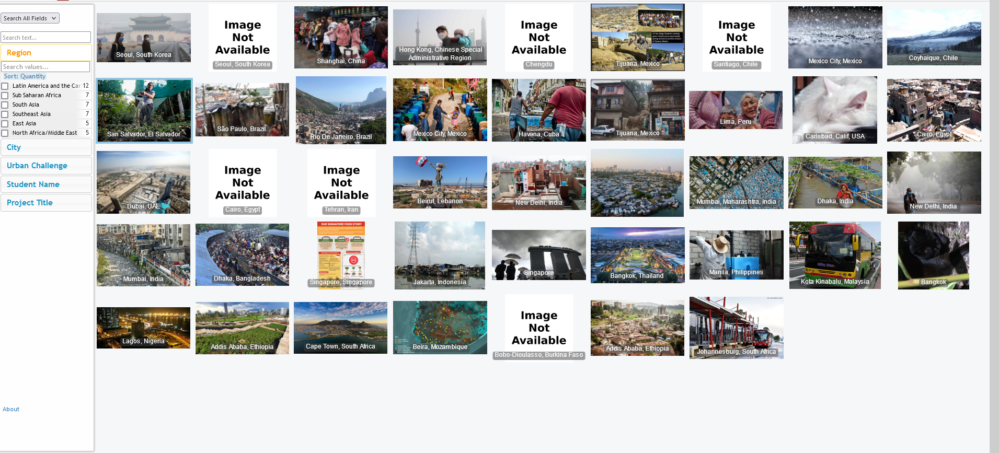

    - Starting with BasedOn, we see that we're pulling from the survey question that has the ID of "ProImage"
    - Next, the value for Mapper shows that we are formatting SuAVE to just insert the response data from our question with no extra characters.
    - The ExpressionType explicitly tells SuAVE to format our file upload question response as an image.

### Testing:

- When setting up the mapping from LimeSurvey to Google spreadsheet, it is recommended that you should check one line of mapping at a time (e.g. type in the map for survey participant's names and test to see if it works). To do that efficiently, use the following website: [https://limesurvey.sdsc.edu/limesurvey-update](https://limesurvey.sdsc.edu/limesurvey-update)
- Note that you will be prompted for a username (lsadmin) and a password(VocalMimic).
- The point of this website is to force the spreadsheet to refresh so you don't need to fill out a new survey for testing purpose every time you change something in the mapping.

### Checkpoint

- By now you should have **a link to a google spreadsheet,** which is formatted in the method described above.
- Checklist
  - [ ] Google Spreadsheet Link
********************************************************************************************************************************************************************************************

## Checkpoint

- By now you should have the **survey id** and a list of the **question codes** that pertain to the responses you would like to display in SuAVE
- Checklist
  - [ ] Survey ID
  - [ ] Question Codes

## Part 4 (Optional) - Survey Logic

Survey Logic is a high level concept that manipulates the survey in a way that certain questions are only available based on answers to previous questions. If you are not familiar with this, then this may not be the best idea, unless it is very basic.

********************************************************************************************************************************************************************************************
Include exactly how to do it
********************************************************************************************************************************************************************************************

## Part 5 (Optional) - Creating SuAVE Visualization

********************************************************************************************************************************************************************************************
Copy existing stuff 
********************************************************************************************************************************************************************************************

To test if you properly synched your Limesurvey survey to the SuAVE visualization, manually enter a response to the survey in the Google Sheets. After a few minutes, navigate to the correct SuAVE visualization; it should appear now. If not, make sure you followed every step correctly. If it works fine, clear the fake entry in the Google Sheets file.

## Checkpoint

- By now you should have the **survey id** and a list of the **question codes** that pertain to the responses you would like to display in SuAVE
- Checklist
  - [ ] Completed Limesurvey survey
  - [ ] Google Sheets Mapper
  - [ ] Working SuAVE Visualization


## Part 6 - Sending Out Your Survey

When sending out your survey to get responses, you have two options: sending out personalized links based on a participants table or a registration form. If you have a list of participants that should fill out the survey (such as a class roster), follow **Part A**; if you do not have a list of participants that should fill out the survey and want anybody willing to fill out the survey to do so, follow **Part B**.

#### Part A - Defined Participants Table
********************************************************************************************************************************************************************************************
MAKE SURE ITS first name, last name, and email
FINISH THE LIST SO THAT IT IS ACCURATE
********************************************************************************************************************************************************************************************
1. Get your participants table. The table needs the following three columns at the minimum: first name, last name, and email. 
2. Export this file as a csv
3. Navigate the the Participants tab in Limesurvey
4. If prompted to, make the survey closed access and initialize a participants table (if these options do not pop up, do not worry)
5. Under the Participants tab, navigate to “Import” and upload your csv
6. Create tokens for each participant. Click “Generate Tokens” and hit “Create”
7. Now, edit your survey email templates. Navigate to “Email templates”
8. Edit these templates as you see fit. Make sure to edit both the “Invitation” and “Reminder” email templates
9. Once you are ready, go back to the “Participants” tab. Select all participants you want to send the survey to and click on “With Selected”. Click “Send Invitation”
10. Some people may not receive the email or may not acknowledge the email and fill out the survey. If this is the case, send a reminder email to individuals that do not fill out the survey at your discretion.

#### Part B - Creating a Registration Form
********************************************************************************************************************************************************************************************
Copy existing stuff 
********************************************************************************************************************************************************************************************

## Part 7 - Accessing Results

Once you have sent out your survey—via a survey registration form or personalized link—responses to your survey will start coming in. Sometimes, the Google Sheets form will not automatically update to include all responses. To manually, update the Google Sheets with responses, go to [https://limesurvey.sdsc.edu/limesurvey-update](https://limesurvey.sdsc.edu/limesurvey-update). You will be prompted for a username (**lsadmin**) and a password (**VocalMimic**). Next, enter your 6-digit survey identifier and click “Update”. Once the little gray box that says that everything has updated properly pops up, all responses should now be available in the Google Sheets.


